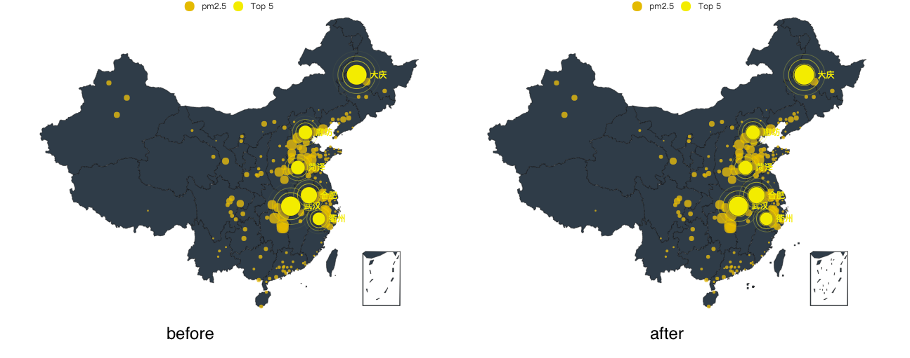
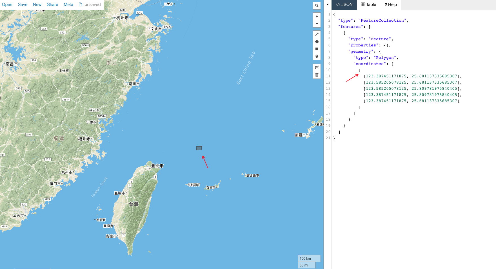

## Fix Echarts China map

Echarts中国地图组件对某些地理位置的渲染无法满足项目运营需求，其中：钓鱼岛、赤尾屿、台湾周边岛屿、东沙群岛以及南海诸岛均有缺失，需手动fix Echarts源码来解决。

Fix前后效果对比：


### 实现原理

通过修改echarts部分源码，可以实现我们的定制化需求。

我们的首要问题是，echarts对某些岛屿的绘制无法满足我们的需要。既然如此，我们就可以定位相关源码，手动Fix。

通过阅读查找echarts源码，可以发现，对geo的处理主要在`echarts/lib/geo`文件夹下。
其中`Geo.js`文件包含了`Geo`构造函数，我们可以从中发现官方对钓鱼岛做了fix，但尽管如此还是无法满足我们的需求，不过我们可以参考此方案来根据需要进行fix。

阅读`echarts/lib/geo/fix/diaoyuIsland.js`文件。可以发现该文件包含了一个`points`变量和一个默认导出的方法。
```
var points = [];

function _default(geo) {
	...
	geo.regions[i].geometries.push({
      type: 'polygon',
      exterior: points[0]
    });
    ...
}

module.exports = _default;
```

其中`points`变量保存了以经纬度坐标为多边形的点围成的该岛屿的[GeoJSON](https://en.wikipedia.org/wiki/GeoJSON)数据。

默认导出的方法对`points`做了特定区域的“挂载”。在`echarts/lib/geo/fix/`文件夹中我们可以看到两个比较特殊的文件，`diaoyuIsland.js`和`nanhai.js`。两个文件中包含了两种可以fix渲染区域的方式，其中`diaoyuIsland.js`中是以挂载`points`到`geo.regions`中某个特定区域的方式。`nanhai.js`则是新建了一个`region`对象并合并到了`geo.regions`所表示的区域数组中。

这里`geo.regions`所表示的数据中保存了地图中的特定区域的描述对象，即一块独立的特定区域。对应到中国地图则是表示了诸如，北京，上海，广州，台湾等行政区划。其中每一个特定区域大致由如下方式创建：
```
new Region(name, zrUtil.map(points, function (exterior) {
  return {
    type: 'polygon',
    exterior: exterior
  };
}), geoCoord)
```
其中`name`表示该区域名称，例如：南海诸岛，台湾等。`points`是一个多维数组，保存了该区域轮廓的经纬度坐标，其表示方式遵循[GeoJSON](https://en.wikipedia.org/wiki/GeoJSON)格式。

需要留意的一点是，由于南海诸岛的特殊性，对南海诸岛的表示，并没有按现实生活中实际的经纬度坐标描述。而是以`[126, 25]`为左上顶点进行的扩展绘制。

### 绘制特定区域

Echarts的地理数据结构遵循GeoJSON标准。`GeoJSON`是一种用于编码各种地理数据结构的格式，其标准为`RFC 7946`，[了解更多](http://geojson.org/)。

如上文所述，我们只需要提供相关区域的`points`即可，即通过GeoJSON的格式来表示地图上某些缺失的点。

我们可以使用[http://geojson.io](http://geojson.io)快速画出某些特定区域，并拿到相应的GeoJSON。如下图所示，确定钓鱼岛真实经纬度，绕该经纬度附近简单绘制钓鱼岛轮廓，从而拿到对应`GeoJSON`。


### 修改目标源码

Echarts的绝大部分内部模块一般情况下是不建议外部引用的。允许被引用的模块声明在[echarts/echarts.all.js](https://github.com/apache/incubator-echarts/blob/master/echarts.all.js)文件中。我们可以从`echarts/lib/*`和`echarts/src/*`中按需引用所需模块。关于两个命名空间的异同可以参考[官方文档](http://echarts.baidu.com/tutorial.html#%E8%87%AA%E5%AE%9A%E4%B9%89%E6%9E%84%E5%BB%BA%20ECharts)。在这里我们统一使用`echarts/lib/*`。

`map`模块的入口为`echarts/lib/component/geo.js`，我们顺着map模块的引用关系进一步找到需要修改的地方。

`geo.js`导入了`GeoModel`，`geoCreator`，`GeoView`三个构建geo实例的构造函数和方法。转到`echarts/lib/coord/geo`文件夹下，可以看到，`geoCreator`文件是用来实例化Geo构造函数的。我们的重点就在`Geo.js`文件，该文件中的代码是geo的构造函数，可以在依赖模块中发现官方是有提供有关于钓鱼岛和南海诸岛的fix的。

官方提供的fix是按照钓鱼岛或南海诸岛的实际经纬度描述的。由于整个`地图的比例关系`，Echarts所在`DOM容器的尺寸`，以及对`图表的缩放（zoom）`处理，导致我们在大多数情况下看到的敏感区域都是存在争议的。

Fix钓鱼岛及台湾附近岛屿:

打开`echarts/src/coord/geo/fix/diaoyuIsland.js`文件，使用[http://geojson.io](http://geojson.io)快速拿到钓鱼岛的`GeoJSON`数据，使用该`GeoJSON`文件中`coordinates`替换`diaoyuIsland.js`中的`points`。为了方便，在这里我们直接将钓鱼岛及其附近岛屿，赤尾屿及其附近岛屿，台湾海峡诸岛屿，台湾右侧诸岛屿直接挂到台湾区域，即
```
if (geo.regions[i].name === '台湾') {}
```
由于我们添加的是多个区域点，在原有单个geo实体（`geometries`）合并的基础上，修改为遍历合并我们新增或fix的经纬度`points`。
```
for (var j = 0, jLen = points.length; j < jLen; j++) {
    geo.regions[i].geometries.push({
        type: 'polygon',
        exterior: points[j]
    });
}
```

具体代码请参考相关文件。

*Tip：为了强调某些敏感区域，我们可以适当扩大该区域轮廓，即以该区域实际经纬度为中心扩大该区域轮廓，以适应运营需求。*

### 在项目中使用

#### Webpack resolve方案

一般情况下，我们不建议直接修改`node_modules`中的源码，或者将`node_modules`上传至git仓库。如果你在项目中使用`webpack`作为打包工具，可通过添加`resolve alias`的方式来更改`webpack`打包时的模块引用路径，进而可以以一种可扩展的方式更改依赖源码。
```
resolve: {
    alias: {
        'echarts/lib/component/geo.js': resolve('static/fixChinaMap/lib/component/geo.js')
    }
}
```

我们将echarts的geo.js模块指向了新建的自定义模块`static/fixChinaMap/lib/component/geo.js`，其内容为node_modules中所对应的echarts源码的拷贝，由于该模块存在一些模块的相对引用，我们需要更改这些模块的引用路径，将相对路径替换为echarts模块下绝对路径。
```
# before
require('../geo/GeoView');
# after
require('echarts/lib/component/geo/GeoView');
```
需要修改其源码的可手动指向当前项目的自定义路径，将相关依赖模块路径纠正完毕。从map模块入口到最终需要fix的模块的引用关系如下：

```
└── echarts/lib/component/geo.js
    ├── echarts/src/coord/geo/geoCreator.js
    │   ├── echarts/src/coord/geo/Geo.js
    │   │   ├── echarts/src/coord/geo/fix/**
```
确定了模块依赖之后，我们可以按照上文中所述的原理及实现方式fix有问题的区域。我们还可以新建相关区域对象，添加到`echarts/src/coord/geo/Geo.js`中的`geoFixFuncs`数组中，实现任意区域的hack。同样，我们也可以通过`new Region`以类似南海诸岛的方式创建新的特性区域，来拓展现有map。

具体源码请参考相关文件。

#### 自定义构建方案

我们可以在修改以上相关源码之后，自定义构建只包含echarts map相关组件的图表组件，以便在项目中直接引用。 Echarts官方提供了[自定义构建Echarts](http://echarts.baidu.com/tutorial.html#%E8%87%AA%E5%AE%9A%E4%B9%89%E6%9E%84%E5%BB%BA%20ECharts)的方案。

使用`echarts/build/build.js`脚本自定义构建。我们需要到`node_modules`中直接修改Echarts源码（其源码修改过程同以上原理），然后运行echarts提供的打包脚本进行自定义打包构建。另外直接使用构建工具（如`rollup`、`webpack`、`browserify`）自己构建，道理也是相同的。本方案最终的产出将是定制化的、可以直接在浏览器端项目中使用的图表组件。

我们以`echarts/build/build.js`脚本为示例演示如下：

如上文中所介绍的原理及方案，修改node_modules中echarts相关源码，fix完成后。在当前项目目录新建`echarts.custom.js`文件，在该文件中引用相关echarts依赖，
```
export * from 'echarts/src/echarts';
import 'echarts/src/chart/map';
import 'echarts/src/component/geo';
```
保存，运行`echarts/build/build.js`脚本
```
node node_modules/echarts/build/build.js --min -i echarts.custom.js -o lib/echarts.custom.min.js --lang en
```
即可在同层目录得到自定义构建的map图表组件。

至此，主要fix逻辑已及实现方案已介绍完毕。可查看本文提供的示例了解更过细节。

注：本文Echart版本`^4.1.0`，其他相近版本同理。

### 相关链接

[GeoJSON](http://geojson.org/)

[自定义构建ECharts](http://echarts.baidu.com/tutorial.html#%E8%87%AA%E5%AE%9A%E4%B9%89%E6%9E%84%E5%BB%BA%20ECharts)

[webpack resolve](https://webpack.js.org/configuration/resolve/)

[http://geojson.io](http://geojson.io)

*最后更新2018-9-17 wangyazhe(wangyazhe@baidu.com)*